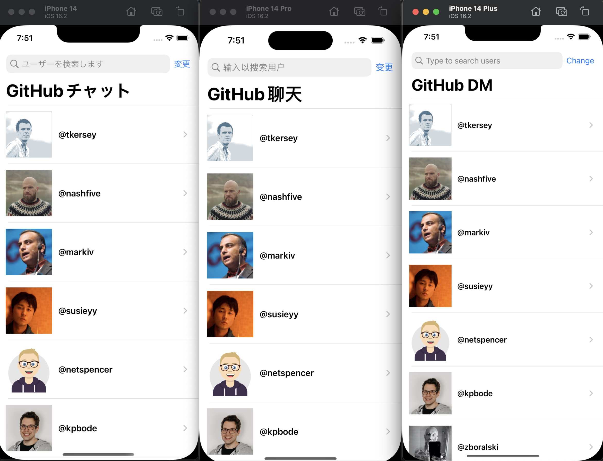

# GitHub Direct Message Portfolio App - GitHeello

## Versions

- Xcode 14.2
- Swift 5
- iOS 16.2

## About the app

GitHeello is a sample iOS app that I built from scratch. It was meant to be used as my portfolio app.

### What's in the app

- Two screens: followers list & direct message.
- The followers list uses real GitHub API to fetch real followers.
- The direct message screen is a mock to demonstrate my UI skills.
- Built with scalability, maintainability, and testability in mind:
  - Adopts clean architecture, dividing the app into 3 layers.
  - Custom implementations of networking, local persistence, and UI navigation services.
  - Includes sample unit test cases, more tests can be easily added later as the needs arise.
- User-friendly UI behaviours:
  - Localization
  - Light & dark mode
  - Dynamic type
  - Device orientation support
  - Shimmering animation
  - Pull down to refresh
  - Infinite scrolling
- Built from scratch within a day (approximately 14 hours of coding) without any 3rd party framework dependencies.

Overall, GitHeello is an app that shows my understanding of iOS development and reflects my current programming skills.

## Features

### Localization
- English
- Japanese
- Chinese

| Support 3 languages |
|:---:|
|  | 

### Adaptive UI
- Support light & dark mode
- Support portrait & landscape mode
- Support Dynamic Type
- Rich UI

| Light & Dark mode | Portrait & Landscape mode |
|:---:|:---:|
|  |   |
| Dynamic Type | Rich UI |
|  |   |

### Clean Codebase
- Use modern Swift Concurrency (async/await) to write readable asynchrounous code
- Use Combine for reactive programming
- Use modern **UIKit** techniques to layout UI: `DiffableDataSource` & `CompositionalLayout`

## Architecture
- Adopt **Clean Architecture** proposed by *Robert C. Martin*
- Split app logic into 3 layers: Domain, Presentation, Infrastructure (from inside to outside)

- Use **MVVM** architectural design pattern in Presentation layer
- Use `BindableVC` protocol to simplify binding between view controller and view model

## UI
- Choose **UIKit** over **SwiftUI** for better backward compatibility
- Use Interface Builder (IB) to layout basic UI
- Do NOT use storyboards, use .xib files instead

## Naming Conventions & Terms
- Protocols are usually named as `XXXProtocol` or `XXXable`
- 'Layer' in this app can be considered as a synonym of 'Module'.  
In this sample app, for the sake of simplicity, layers are only folders. But they were set up with modular design bearing in mind, thus they can be easily put into their own module (framework) if the needs arise in the future.
- `Service`s are low level infrastructure protocols which are NOT supposed to be directly accessed by the presentation layer.  
They are usually generic, and are used to compose a use case.  
e.g. `HttpServiceProtocol`, `PersistenceServiceProtocol`
- `UseCase`s are high level protocols which CAN be injected into and used by presentation layer components.  
They are used as boundaries between low level infrastructures and high level UI components, abstracting service implementation details from the presentation layer.
Use cases are also protocol based, thus can be easily mocked, making unit tests easy.  
e.g. `GetFollowersUseCaseProtocol`, `MessageUseCaseProtocol`

## What's Implemented
- [x] Modern Architecture with modularity and testability in mind (protocol oriented, MVVM)
- [x] Handle GitHub API rate limit error (display GitHub returned error message in alert)
- [x] Handle followers list paging (infinite scrolling, pull down to refresh)
- [x] Change initial user account ID from UI (work with any GitHub account)
- [x] Use a scene based coordinator for navigation
- [x] Dummy echo response
- [x] Portrait & landscape, layout change when changing
- [x] Dark mode, dynamic type support
- [x] Smooth & Friendly UI (image caching, shimmering loading animation, empty message)
- [x] Persist messages history between sessions
- [x] Localization (English & Japanese & Chinese)

## To Improve
- [ ] Fully unit test services
- [ ] Come up with a better way to switch user account, currently if you make a typo in username, you end up with an not very helpful 404 error.
